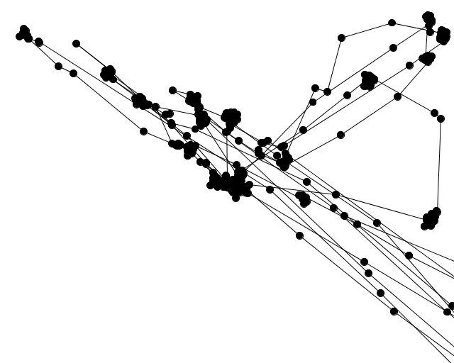

tobii_eytracker_csv_reading_11EG_B_WS1314
=========================================

This sketch is part of the course ["Eingabe, Ausgabe. Grundlagen der prozessorientierten Gestaltung"](https://incom.org/workspace/4693) by Monika Hoinkis  

It takes CSV files created by the Tobii Eyetracker from the Usability Lab and displays some data. The files should not have the headers and filter settings applied when exporting tsv from Tobii Studio.    

##usage:  

- Place your .csv files in the folder `csvfiles`.
- add your filenames to the csvfiles ArrayList like this:  

    csvfiles.add(new CSVFile("csvfiles/tobii-CSVExport-All-Data-noheader-nofilter.tsv", "\t", true,false));  
    csvfiles.add(new CSVFile("csvfiles/Rec 04-All-Data-2stimuli.tsv", "\t", true,false));  
    csvfiles.add(new CSVFile("csvfiles/Rec 01.tsv", "\t", true,false));  
    csvfiles.add(new CSVFile("csvfiles/Rec 02.tsv", "\t", true,false));  

Run the sketch.  

  

Copyright (c)  2013 Fabian "fabiantheblind" Morón Zirfas  
Permission is hereby granted, free of charge, to any person obtaining a copy of this software and associated documentation files (the "Software"), to deal in the Software  without restriction, including without limitation the rights to use, copy, modify, merge, publish, distribute, sublicense, and/or sell copies of the Software, and to  permit persons to whom the Software is furnished to do so, subject to the following conditions:  
The above copyright notice and this permission notice shall be included in all copies or substantial portions of the Software.  
THE SOFTWARE IS PROVIDED "AS IS", WITHOUT WARRANTY OF ANY KIND, EXPRESS OR IMPLIED, INCLUDING BUT NOT LIMITED TO THE WARRANTIES OF MERCHANTABILITY, FITNESS FOR A  PARTICULAR PURPOSE AND NONINFRINGEMENT. IN NO EVENT SHALL THE AUTHORS OR COPYRIGHT HOLDERS BE LIABLE FOR ANY CLAIM, DAMAGES OR OTHER LIABILITY, WHETHER IN AN ACTION OF  CONTRACT, TORT OR OTHERWISE, ARISING FROM, OUT OF OR IN CONNECTION WITH THE SOFTWARE OR THE USE OR OTHER DEALINGS IN THE SOFTWARE.  

see also http://www.opensource.org/licenses/mit-license.php

